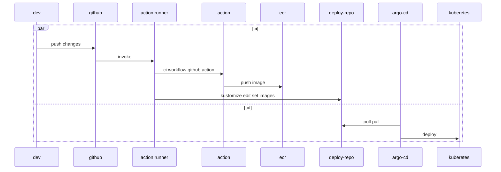

TLDR:  my CICD choice: argo-cd and argo-workflow

Since I chose argocd and github action as our CICD pipeline two years ago, I rarely thought about other choices and the reason I made the choices. Recently I leant from several sources that jenkins is still widely used, it arouse my interest on this subject again. I reconsidered my choice and layed out the reasons here for my future references.

I didn't have a good impression with java in my past java projects. The only things left in my minds are slowness, verboseness, memory hog, OutOfMemoryError PermGen errors. There were other factors drove me aways. Jenkins was out of the candidate list.

> other factors
> * Oracle to start charging for java
> * jenkins is not cloud-native
> * ... others ?

Our infrastructure was based on kubenretes and the logical solution I sought was a cloud-native one. Argo-CD and fluxcd were on my radar at that time. There was one thing of fluxcd that kept me from adopting it: one repositry. That decision also made me doubt if fluxcd is a good choice, maybe there were inapproproate assumptions in its design and implementments as well. I thougt that the result of the comparison of the other metrics of the two projects such as github stars, contributors etc confirmed my impression of fluxcd and argocd. Finally, argo-cd is the one.

One month ago, [I still didnt' choose jenkins-x](https://jackliusr.github.io/posts/2022/05/reflection-on-implementation-of-cicd-using-argo-workflows/). This time, I didn't like the component-tekton in its implementation and I didn't think much about other factors. Today, I followed the same comparison method I used when I chose argo-cd. Argo-workflow is the clear winner. 

After my usage of argo-cd, argo-workflow and argo-events, I am a big fan of argoproj now. I might try to use argo-rollout in the future.
