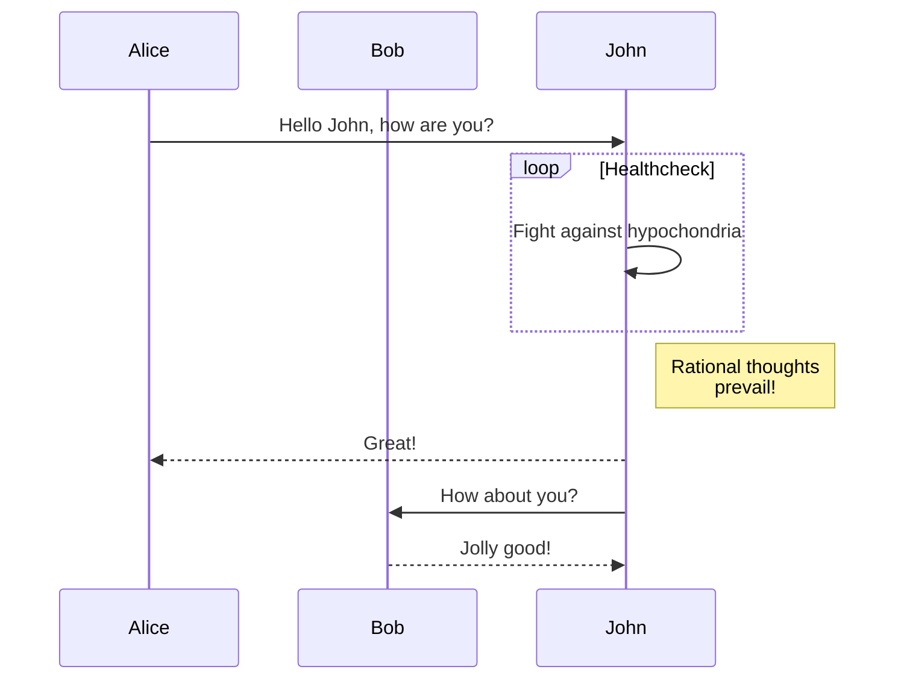

Since I read the textual UML in the [2015 techradar](https://www.thoughtworks.com/en-sg/radar/tools/plantuml), I am a big fan of it. I used plantuml in my technical writing in Asia Fusion Technology. Later I found asciidoc, and I wanted to [combine the two together](https://github.com/jackliusr/hugo-builder). I regularly read techradar from thoughtworks and found mermaidjs in [NOV 2018 techradar](https://www.thoughtworks.com/radar/tools/mermaid). However it was little hard to integrate that into my site at that time. Today I knew [Hugo supports Mermaid Diagrams easily](https://gohugo.io/content-management/diagrams/#mermaid-diagrams). I made some tweaks to my docker image jackliusr/hugo-builder to support that. Now it is time to give it a go. This is my first trial mermaid diagrams in hugo. Hope it work.

## References: 
* https://gohugo.io/content-management/diagrams/