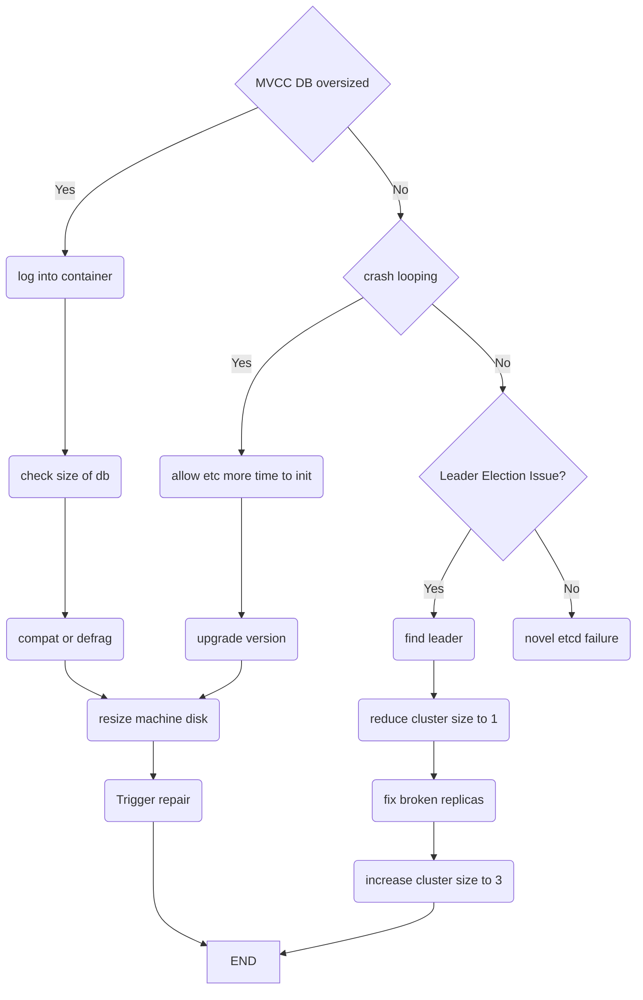

etcd debugging flowchart, copy the flowchat from "Stories from the Playbook" for easy reference and put here to make it searchable in my site.

## Reference: 
https://static.sched.com/hosted_files/kccnceu18/9a/Stories%20from%20the%20Playbook.pdf#page=5
