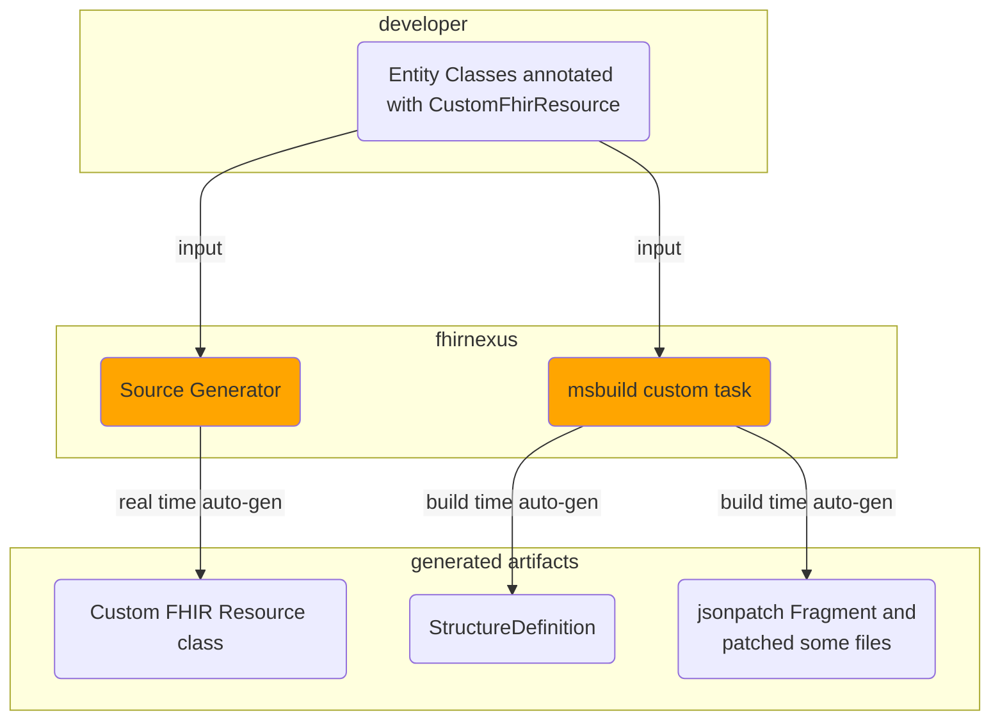

One thing constantly bothered me since I used mermaid for flowchart, how to correctly group elements in a group. Only today I have a thought about what will happen if I put node in subgraph without links between them. Finally I got it works to correctly group elements in a group. 

Another things, mermaid diagram is natively supported in asciidoctor now. This one is my first example to use it. 

