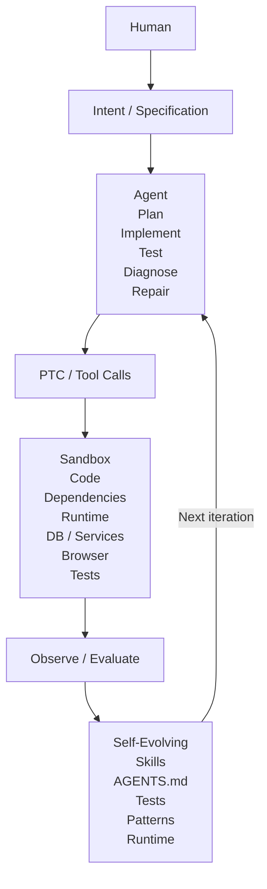

When talking about **AI at scale**, I have always thought about it from the model-serving infrastructure perspective:

- How many GPUs do we need?
- How do we scale inference?
- How do we reduce latency and cost?
- How do we serve millions of concurrent requests?
- How do we efficiently distribute models across GPU clusters?

But there is another way to think about *AI at scale*.

Instead of scaling the AI model itself, what if we scale **software development across ordinary users**?

The goal is not simply to make software engineers more productive. It is to make software-building capability available to people who are not software engineers.

A useful way to frame this is:

> AI at scale = Agent + Sandbox + Self-Evolving + PTC + Tools

## From Scaling Models to Scaling Engineering Capability

Traditional AI-at-scale discussions usually look something like this:

```
Users
    |
    v
AI Application
    |
    v
Model Serving
    |
    +-- GPU Cluster
    +-- Inference Engine
    +-- Load Balancing
    +-- Caching
    +-- Autoscaling
```

This is about scaling the *AI computation*.

But coding agents introduce another possibility:

```
Human
    |
    v
Intent / Specification
    |
    v
Coding Agent
    |
    v
Software
```

The agent is not merely answering questions. It can plan, implement, execute, test, diagnose failures, and repair the implementation.

Once we give the agent a sandboxed runtime and the ability to orchestrate tools programmatically, the architecture becomes much more interesting.

## AI Engineering Runtime

The architecture I have in mind looks like this:



The important part is that this is not simply:

```
Prompt -> LLM -> Code
```

It is an **engineering loop**:

```
    Specify
    |
    v
    Plan
    |
    v
    Implement
    |
    v
    Execute
    |
    v
    Observe
    |
    v
    Evaluate
    |
    v
    Repair
    |
    v
    Learn
    |
    +----> Next iteration
```

The agent can operate inside an environment where it can actually *do* things rather than just describe what should be done.

## 1. Agent

The agent is responsible for the engineering loop.

It can:

- understand the specification
- inspect an existing codebase
- create or modify code
- run commands
- execute tests
- inspect errors
- diagnose failures
- make corrections
- verify the result

This changes the role of the LLM.

It is no longer simply a code generator.

It becomes an **engineering controller** operating over a software environment.

## 2. Sandbox

The sandbox provides a controlled execution environment.

It might contain:

- source code
- package dependencies
- compilers and interpreters
- databases
- external services
- browsers
- test frameworks
- build tools
- observability tools

This is important because an agent needs somewhere to *experiment*.

For example:

```
    Agent
    |
    +-- modify code
    |
    +-- run application
    |
    +-- execute tests
    |
    +-- inspect failure
    |
    +-- modify code again
    |
    +-- run tests again
    |
    +-- verify
```

The sandbox makes failure cheap and recoverable.

The agent can try something, observe the result, and iterate.

## 3. PTC

PTC, or **Programmatic Tool Calling**, is another important piece of this architecture.

Instead of requiring the model to make every tool call individually through the conversational interface, the agent can generate and execute a program that orchestrates multiple tools.

Conceptually:

```
    Agent
        |
        | generate execution program
        v
    PTC Runtime
        |
        +-- inspect repository
        +-- modify files
        +-- run compiler
        +-- execute tests
        +-- query database
        +-- start services
        +-- interact with browser
        +-- collect results
        |
        v
    Agent
```

The program might be written in Python, JavaScript, or another supported language and executed inside the sandboxed environment.

This turns tools from isolated functions into **composable building blocks**.

Even relatively small tools can become surprisingly powerful when they can be composed programmatically.

This is one reason I find the architecture of agents such as Pi interesting: a relatively small set of primitives can provide a lot of capability when the agent can combine them effectively.

## Why PTC Matters

Without programmatic orchestration, an agent may need to repeatedly perform a sequence like:

```
    LLM
    |
    +--> tool call
    |       |
    |       v
    |    result
    |
    +--> LLM
    |
    +--> tool call
    |       |
    |       v
    |    result
    |
    +--> LLM
    |
    +--> tool call
```

With PTC, the agent can instead construct a small execution workflow:

```python
inspect_repo()
modify_files()
run_tests()
collect_logs()
run_diagnostics()
```

The runtime executes the workflow and returns the relevant results.

The model therefore spends more of its reasoning budget on **what should happen**, rather than micromanaging every individual tool interaction.

## 4. Self-Evolving

The most interesting part for me is **self-evolution**.

Self-evolving does not necessarily mean modifying the underlying model.

The surrounding engineering system can evolve instead.

For example, an agent encounters a recurring problem:

```
    Application starts before PostgreSQL is ready
    |
    v
    Integration tests fail
    |
    v
    Agent diagnoses the problem
    |
    v
    Creates a reusable pattern:
    "wait for service health"
    |
    v
    Future agents use the pattern
```

The accumulated knowledge might take many forms:

- `AGENTS.md`
- reusable skills
- scripts
- tests
- architectural patterns
- runtime configuration
- troubleshooting procedures
- domain-specific knowledge
- evaluation criteria

The next agent therefore does not necessarily start from zero.

The system becomes progressively better at solving the class of problems it encounters.

## The Engineering Feedback Loop

This creates an interesting feedback loop:

```
    Experience
        |
        v
    Observe
        |
        v
    Evaluate
        |
        v
    Extract Pattern
        |
        v
    Update Skills / Rules / Tests
        |
        v
    Next Agent
        |
        v
    Better Execution
```

In this sense, the **software engineering environment itself becomes a form of memory**.

`AGENTS.md`, skills, tests, runtime conventions, and previous solutions can encode the accumulated engineering knowledge.

The model does not need to remember everything.

The environment remembers.

## 5. Tools

The final component is tools.

Interestingly, I don't think we necessarily need hundreds of tools.

A small number of well-designed primitives can be enough:

```
filesystem
shell
git
browser
database
HTTP
search
runtime
```

The power comes from **composition**.

A tool that looks trivial in isolation can become powerful when an agent can combine it with other tools inside a sandbox.

For example:

```
    git
    +
    filesystem
    +
    shell
    +
    browser
    +
    tests
    +
    database
```

can become a complete software development workflow.

This is similar to the Unix philosophy:

> Small tools + composition = powerful system.

The difference is that the agent dynamically decides how to compose them.

## Scaling Beyond Engineers

This leads to a different interpretation of *AI at scale*.

Today:

```
    Software engineer
        |
        v
    Software
```

With coding agents:

```
    Software engineer
        |
        +---- AI agent
                    |
                    v
                Software
```

But with an AI engineering runtime:

```
    Domain expert
        |
        v
    Intent / Specification
        |
        v
    AI Engineering Runtime
        |
        +-- Agent
        +-- PTC
        +-- Sandbox
        +-- Tools
        +-- Skills
        +-- Evaluation
        +-- Self-evolution
        |
        v
    Software
```

The human does not necessarily need to know how to implement the software.

They need to know **what they want**, what constraints matter, and what a successful result looks like.

This potentially moves software development from an **engineering-capacity problem** toward a **specification-and-runtime problem**.

## AI at Scale: A Different Definition

This gives me a second definition of AI at scale.

The traditional definition is approximately:

> How do we scale AI inference to serve more users?

The alternative is:

> How do we scale software-engineering capability to enable more people to build software?

The first scales **model execution**.

The second scales **engineering capability**.

And the architecture for the second might look surprisingly simple:

```
        Intent
           |
           v
        Agent
           |
           v
         PTC
           |
           v
       Sandbox
           |
           v
   Observe / Evaluate
           |
           v
    Self-Evolving
           |
           +------> Agent
```

The interesting question is no longer only:

> *How many users can my model serve?*

It becomes:

> *How many people can my engineering runtime enable to build useful software?*

## Not Every Workload Needs This

This architecture is not suitable for every AI workload.

In particular, it is not necessarily appropriate for **latency-sensitive applications** where the additional agentic planning, tool execution, sandbox startup, and iterative evaluation introduce unacceptable latency.

The model is much more interesting for workloads where:

- correctness matters more than milliseconds
- tasks require multiple steps
- software must be created or modified
- experimentation is useful
- failures can be detected and repaired
- execution can happen asynchronously
- the environment can be isolated

Examples might include internal tools, automation, data workflows, developer tooling, prototypes, domain applications, and long-running software-engineering tasks.

## Conclusion

I used to think of **AI at scale** primarily as a model-serving problem.

Now I think there is another dimension.

The interesting scaling opportunity may not only be:

```
more GPUs
more inference
more users
```

but:

```
more people
more software
more autonomous engineering
```

An **Agent + Sandbox + PTC + Tools + Self-Evolving environment** provides a possible foundation for this.

The ultimate abstraction may be neither a chatbot nor a coding assistant.

It may be an **AI Engineering Runtime**:

> Give the system an intent, a constrained environment, tools, and a definition of success — and let it build, execute, evaluate, repair, and improve the software.

That is a very different way of thinking about **AI at scale**.
